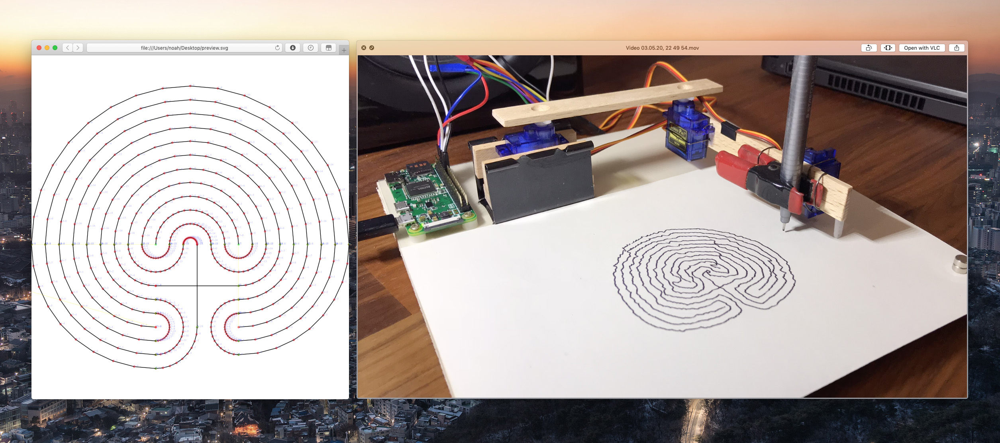

# brachiosaurus

*An incredibly basic [turtle drawing](https://en.wikipedia.org/wiki/Turtle_graphics) tool I've built for making generative art with my [BrachioGraph pen plotter](https://www.brachiograph.art).*




## Setup

[Build a BrachioGraph and set it up with a Raspberry Pi according to the instructions.](https://www.brachiograph.art)

The Python 3 script `brachiosaurus.py` contained in this repository has *no dependencies* aside from the standard library. **If you run it on a computer whose hostname is `raspberrypi`, it'll dynamically attempt to `import brachiograph` and draw the programmed pattern, otherwise it'll generate an SVG version (see above) instead and emit it on `stdout`.**

The Raspberry Pi hostname (and the BrachioGraph configuration – the default probably won't be accurate for your build) are configurable at the top of `brachiosaurus.py`.


## Deployment

Copy `brachiosaurus.py` to the directory on your Raspberry Pi in which you've installed the BrachioGraph software. With my setup, that's done like this:

```bash
scp ~/Dropbox/code/brachiosaurus/brachiosaurus.py pi@raspberrypi.local:/home/pi/BrachioGraph/
```


## Usage

Place the code to generate the image you'd like to draw inside the `main` function.

Similar to how you'd use the default BrachioGraph software – on your Raspberry Pi, after boot, run `sudo pigpiod` to set up hardware servo timing. Then:

```bash
cd BrachioGraph
source bin/activate
python3 brachiosaurus.py
```

Alternatively, on your "development" machine where you haven't set up the BrachioGraph software, simply run

```bash
python3 brachiosaurus.py > ~/Desktop/preview.svg
```

and open `preview.svg` in a web browser or other SVG viewer of your choice. **This allows for fast and easy development of a [complicated drawing](https://twitter.com/Doersino/status/1257051977202229248) without having to actually plot it until it's right**, although I advise not previewing simpler ones – you never know which [happy accidents](https://twitter.com/Doersino/status/1257052900334936071) you'd miss.


### You want to keep library and drawing code separate?

Not a bad idea at all! Create a file `mydrawing.py` next to `brachiosaurus.py`:

```python
import brachiosaurus as bs  # heartbreakingly, python won't accept 🦕 as an alias

c = bs.Canvas()

# turtle drawing commands go here

plotter = bs.AutoPlotter().from_canvas(c)
#plotter = AutoPlotter().from_file("test-patterns/accuracy.json")
plotter.emit()
```

Then, as above, deploy this new file to your Raspberry Pi:

```bash
scp ~/Dropbox/code/brachiosaurus/mydrawing.py pi@raspberrypi.local:/home/pi/BrachioGraph/
```

And run it:

`python3 mydrawing.py`.

Or run it without deployment:

```bash
python3 ~/Dropbox/code/brachiosaurus/mydrawing.py > ~/Desktop/preview.svg
```


### You're looking for some examples?

Look no further than `examples.py` – which has the same structure as the `mydrawing.py` file outlined above and can be deployed and run in the same manner – where I've been collecting the code of some drawings I've made myself.
